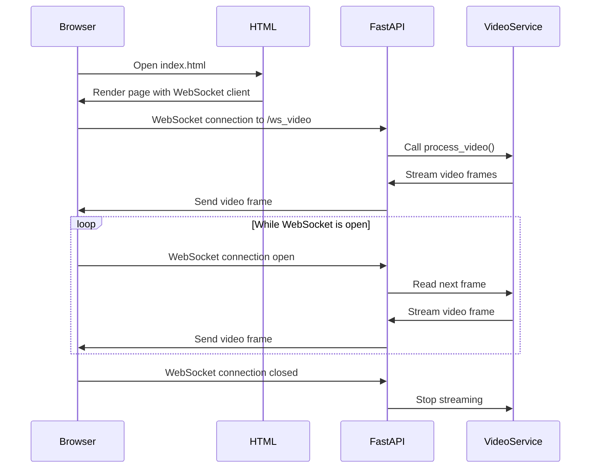

[](https://codecov.io/gh/arturogonzalezm/computer_vision_example)
[](https://github.com/arturogonzalezm/computer_vision_example/actions/workflows/codecov.yml)
[](https://github.com/arturogonzalezm/computer_vision_example/blob/master/LICENSE)

# WebSocket Video Streaming Service

This project is a FastAPI application that streams video frames over a WebSocket connection. The frames are captured from a video file and sent to connected clients in real-time.

## Project Structure

The project consists of the following files:

```bash
computer_vision_example/
├── app.py
├── index.html
├── utils/
│ └── logger.py
├── routes/
│ └── video.py
├── services/
│ └── video_service.py
└── tests/
├── init.py
├── test_video_service.py
└── test_websocket.py
```
## Diagram



## Setup

### Install Dependencies

Make sure you have Python installed. Then, install the required packages using pip:

```bash
python -m pip install --upgrade pip
python.exe -m pip install -r requirements.txt
```

### Run the Application

Start the FastAPI application using Uvicorn:

```bash
cd computer_vision_example/

uvicorn app:app --workers 4 --reload

python -m http.server 8001
``` 

The application will be available at `http://localhost:8000`.

### Run the Tests

Run the tests using the following command:

```bash     
pytest tests/
```

## Suggested Usage

1. Open the application in a web browser at `http://localhost:8000`.
2. Click the `Start` button to start the video stream.
3. Click the `Stop` button to stop the video stream.
4. Click the `Clear` button to clear the video stream.
5. Click the `Download` button to download the video stream as a file.
6. Click the `Save` button to save the video stream as a file.
7. Click the `Load` button to load a video file.
8. Click the `Upload` button to upload a video file.
9. Click the `Play` button to play the video stream.
10. Click the `Pause` button to pause the video stream.
11. Click the `Seek` button to seek to a specific frame in the video stream.
12. Click the `Forward` button to move forward in the video stream.
13. Click the `Backward` button to move backward in the video stream.
14. Click the `Speed` button to change the speed of the video stream.
15. Click the `Volume` button to change the volume of the video stream.
16. Click the `Mute` button to mute the video stream.
17. Click the `Unmute` button to unmute the video stream.
18. Click the `Fullscreen` button to enter fullscreen mode.
19. Click the `Exit Fullscreen` button to exit fullscreen mode.
20. Click the `Settings` button to change the video stream settings.
21. Click the `About` button to view information about the video stream.
22. Click the `Help` button to view help information about the video stream.
23. Click the `Close` button to close the video stream.
24. Click the `Exit` button to exit the video stream.
25. Click the `Refresh` button to refresh the video stream.
26. Click the `Reload` button to reload the video stream.
27. Click the `Reset` button to reset the video stream.
28. Click the `Clear Cache` button to clear the video stream cache.
29. Click the `Clear Cookies` button to clear the video stream cookies.
30. Click the `Clear Storage` button to clear the video stream storage.
31. Click the `Clear History` button to clear the video stream history.
32. Click the `Clear Data` button to clear the video stream data.
33. Click the `Clear All` button to clear all video stream data.

## License

This project is licensed under the MIT License - see the [LICENSE](LICENSE) file for details.

